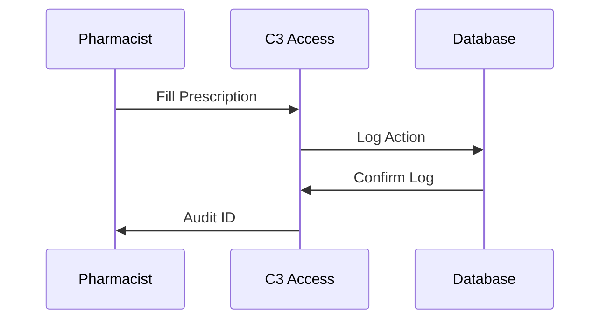

## Overview

C3 Access provides essential tools for pharmacy organizations to maintain compliance with regulations like DEA requirements and HIPAA standards. You can track prescriptions, generate reports, manage user access, and maintain audit logs all in one platform. Use the features below to streamline your compliance workflow.

<Columns cols={2}>
  <Card title="Compliance Tracking" icon="shield" href="#compliance-tracking">
    Monitor prescription fills and controlled substances in real-time.
  </Card>
  <Card title="Reporting Tools" icon="bar-chart-3" href="#reporting">
    Create custom analytics reports for audits and reviews.
  </Card>
  <Card title="User Roles" icon="users" href="#roles">
    Assign permissions to team members for secure access.
  </Card>
  <Card title="Audit Trails" icon="file-text" href="#audit">
    Log all actions with tamper-proof documentation.
  </Card>
</Columns>

<Callout kind="info">
  Start with compliance tracking to get immediate visibility into your pharmacy operations.
</Callout>

## Compliance Tracking and Monitoring

Set up real-time monitoring for prescription compliance. C3 Access scans fills against regulatory thresholds and alerts you to potential issues.

<Steps>
  <Step title="Connect Data Sources" icon="database">
    Link your pharmacy management system to C3 Access via API.

````javascript
const response = await fetch('https://api.example.com/v1/compliance/sources', {
  method: 'POST',
  headers: { 'Authorization': 'Bearer YOUR_TOKEN' },
  body: JSON.stringify({ source: 'pharmacy_system' })
});
````

  </Step>
  <Step title="Define Rules" icon="settings">
    Configure thresholds for controlled substances.

````bash
curl -X POST https://api.example.com/v1/rules \
  -H "Authorization: Bearer YOUR_TOKEN" \
  -d '{"substance": "oxycodone", "daily_limit": 50}'
````
  </Step>
  <Step title="Enable Alerts" icon="bell">
    Set notifications for violations.
  </Step>
</Steps>

## Reporting and Analytics Tools

Generate insights with customizable dashboards. Export data for external audits.

<Tabs>
  <Tab title="DEA Reports" icon="file">
    Focus on Schedule II-V substances.

    <CodeGroup tabs="JavaScript,Python">
```javascript
const reports = await fetch('https://api.example.com/v1/reports/dea', {
  headers: { 'Authorization': 'Bearer YOUR_TOKEN' }
}).then(r => r.json());
```
```python
import requests
response = requests.get(
  'https://api.example.com/v1/reports/dea',
  headers={'Authorization': 'Bearer YOUR_TOKEN'}
)
```
    </CodeGroup>
  </Tab>
  <Tab title="HIPAA Logs" icon="shield">
    Track access to patient data.
  </Tab>
</Tabs>

| Report Type | Frequency | Export Formats |
|-------------|-----------|----------------|
| DEA Summary | Daily    | PDF, CSV      |
| HIPAA Audit | Weekly   | JSON, Excel   |
| Custom      | On-demand| All           |

## User Roles and Permissions

Control access with predefined roles. Assign permissions to pharmacists, managers, and auditors.

<ParamField path="user.role" param-type="string" required="true">
  Role names: `admin`, `manager`, `pharmacist`, `auditor`.
</ParamField>

<ParamField header="X-Pharmacy-ID" param-type="string" required="true">
  Your organization identifier.
</ParamField>

<Expandable title="Advanced Permissions" default-open="false">
  Customize granular access, such as read-only for reports.
</Expandable>

## Audit Trails and Documentation

Maintain complete records of all actions. Every change logs who, what, and when.



<Board title="Compliance Workflow">
  <BoardColumn title="Pending Review" color="0" icon="clock">
    <BoardCard title="Rx #12345 Review" description="Check DEA limit" dueDate="2024-12-15" author="Dr. Smith" />
  </BoardColumn>
  <BoardColumn title="In Progress" color="1" icon="loader-2">
    <BoardCard title="Audit Q4" description="Generate report" icon="file-text" />
  </BoardColumn>
  <BoardColumn title="Completed" color="2" icon="check-circle">
    <BoardCard title="Rx #12344 Approved" createdAt="2024-12-10" />
  </BoardColumn>
</Board>

<Callout kind="tip">
  Export audit trails monthly for regulatory submissions.
</Callout>

<Columns cols={2}>
  <Card title="Quickstart" icon="book-open" href="/quickstart">
    Set up your first compliance rule.
  </Card>
  <Card title="API Reference" icon="code" href="/authentication">
    Integrate programmatically.
  </Card>
</Columns>